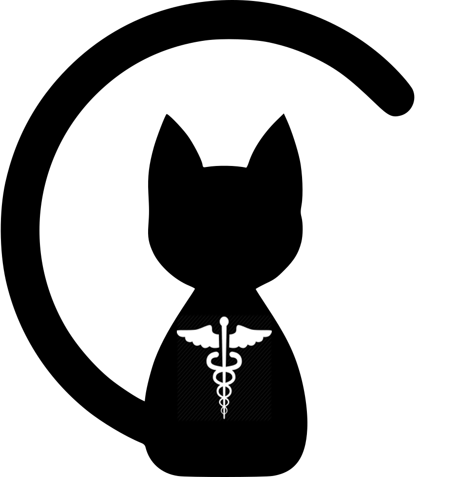
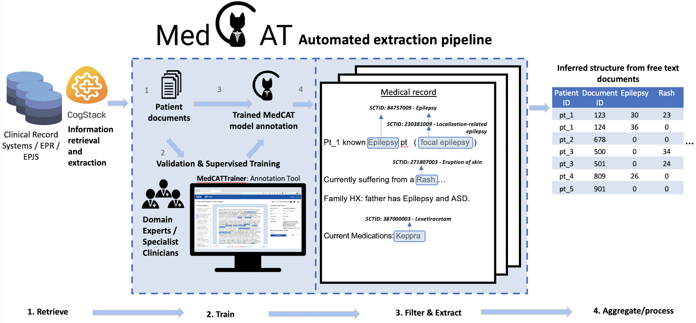

<p align="center">
    
    
    
</p>
                                                                                                           

# Working with CogStack
This repository contains all tools relevant to interacting with an NHS deployment of CogStack. 

It contains:
1)  Easy to follow templates and instructions to interact and search CogStack.
2)  Recommended workflows to create, train, and run, MedCAT models.

For further discussions or questions. Please join our official [CogStack/MedCAT forum!](https://discourse.cogstack.org/)

__NOTE__ this section is currently in development. Let me know if there is anything 
else to add!


## Setup

Users can follow these steps to quickly setup and deploy this repository on their machine.

Any code to enter in these instructions will be represented as `code to enter`.

Please replace anything within `<Enter information here>` with your own specific details.

### Step 1: Clone this repository locally 

1. Enter the directory where you would like to store these files. `cd path/to/where/you/want/this/repository`

2. Clone the online repository: `git clone https://github.com/CogStack/working_with_cogstack.git`
    
    Further instructions and self-help with git and git clone. Please visit this [link.](https://github.com/git-guides/git-clone)
    
    If you choose to use github desktop rather than the terminal please refer to the [official github desktop guides.](https://docs.github.com/en/desktop)

3. Optional: To update to the latest release of this repository: `git pull` 

### Step 2: Creating a virtual environment and required packages
(Requires Python 3.7+)

__Windows__
1. Create a new virtual env: `python3 -m venv venv`
2. Load the virtual environment: `.\venv\Scripts\activate`
3. Install relevant packages and libraries: `pip install -r requirements.txt`


__Linux/MAC OS__
1. Create a new virtual env: `python3 -m venv venv`
2. Load the virtual environment: `source venv/bin/activate`
3. Install relevant packages and libraries: `pip install -r requirements.txt`

*Optional: If no jupyter instance is installed.*
1. In the main folder of this repository. Activate your virtual environment, using the (Step 2) command from your respective OS. 
2. Start JupyterLab: `jupyter-lab`


### Step 3: Enter credentials and Login details
In the main folder of this repository you can populate the [credentials.py](credentials.py) file with your own CogStack hostnames, username and passwords. 

For an automatic authentication experience, the credentials.py contents can be prepopulated with your CogStack instance credentials:
```
hosts = []  # This is a list of your cogstack elasticsearch instances.

# These are your login details (either via http_auth or API)
username = None
password = None
```
For shared machines it is recommended that you leave the passwords blank. This will trigger a prompt in when accessing a cogstack instance.

If you have any questions or issues obtaining these details please contact your local CogStack administrator.

## Contents

## [How to search using CogStack](search)
This directory contains the basics search templates.

For further information on CogStack please visit their [github](https://github.com/CogStack) 
or [wiki page](https://cogstack.org/). 

## [How to create a watcher](watcher)
This directory contains the basics watcher job templates.

## [MedCAT](medcat)
An overview of this process is shown below.
 



Further information about MedCAT can be found from their [github](https://github.com/CogStack/MedCAT) 
or via their official documentation [here](https://medcat.readthedocs.io/en/latest/).

General MedCAT tutorials can be found [here](https://github.com/CogStack/MedCATtutorials).


### Demo
A demo application is available at [MedCAT](https://medcat.rosalind.kcl.ac.uk). This was trained on MIMIC-III to annotate
SNOMED-CT concepts. __Note:__ No supervised training has been provided to this model and therefore should only be used for demonstration
purposes only.

### MedCAT Citation
```
@ARTICLE{Kraljevic2021-ln,
  title="Multi-domain clinical natural language processing with {MedCAT}: The Medical Concept Annotation Toolkit",
  author="Kraljevic, Zeljko and Searle, Thomas and Shek, Anthony and Roguski, Lukasz and Noor, Kawsar and Bean, Daniel and Mascio, Aurelie and Zhu, Leilei and Folarin, Amos A and Roberts, Angus and Bendayan, Rebecca and Richardson, Mark P and Stewart, Robert and Shah, Anoop D and Wong, Wai Keong and Ibrahim, Zina and Teo, James T and Dobson, Richard J B",
  journal="Artif. Intell. Med.",
  volume=117,
  pages="102083",
  month=jul,
  year=2021,
  issn="0933-3657",
  doi="10.1016/j.artmed.2021.102083"
}
```


# Foresight (Coming soon...)
Demo is available [here](https://foresight.sites.er.kcl.ac.uk/)


